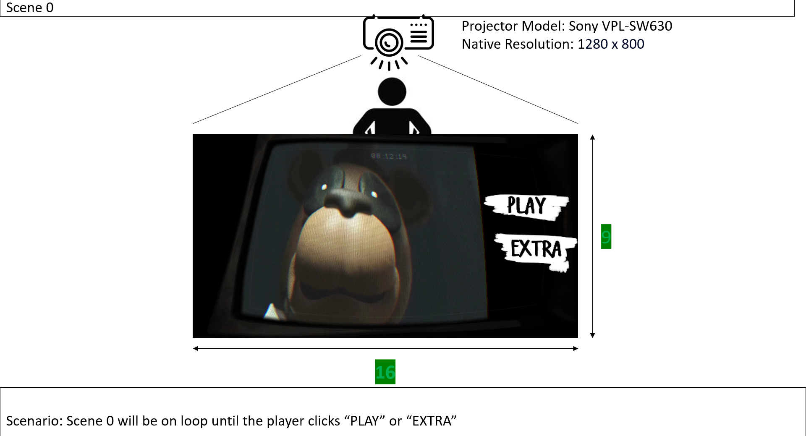
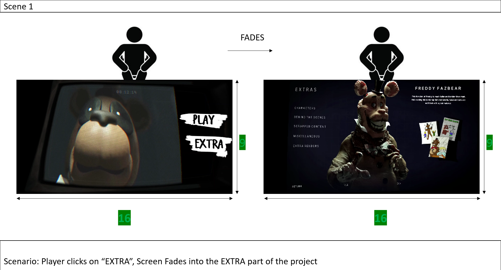
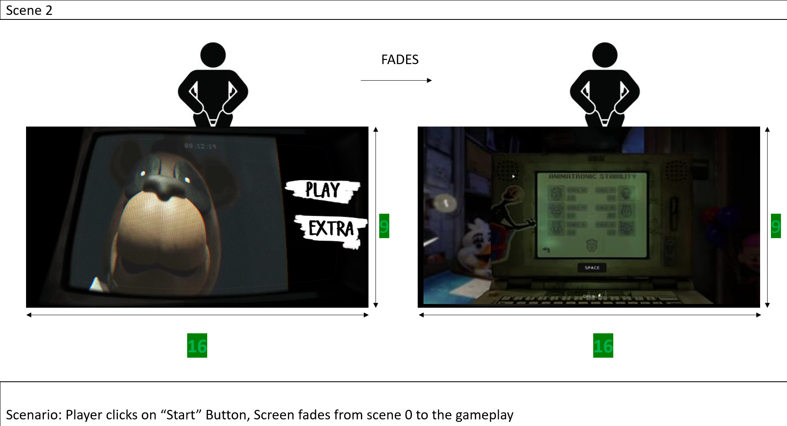
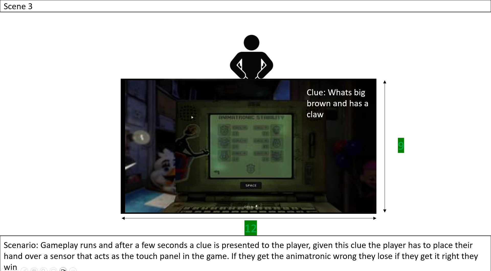
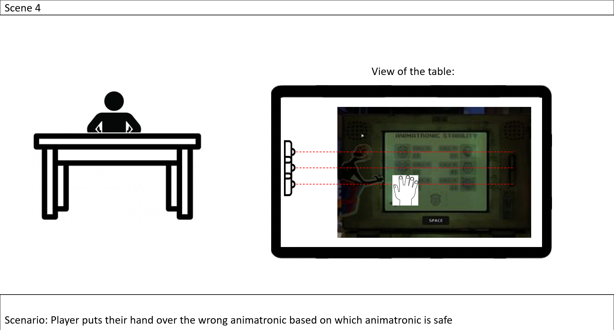
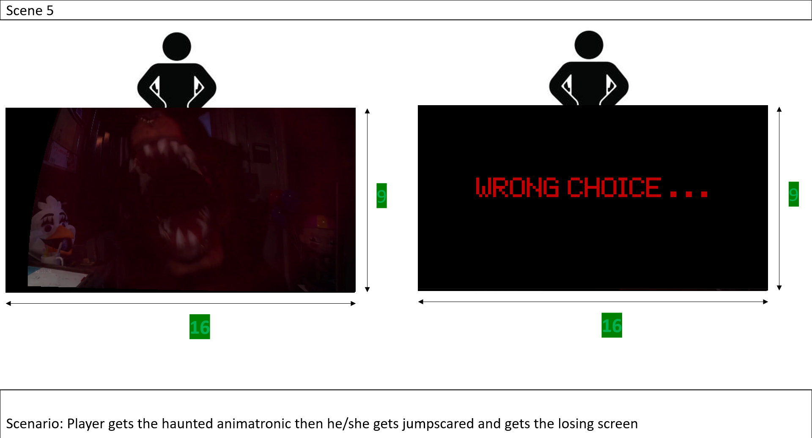
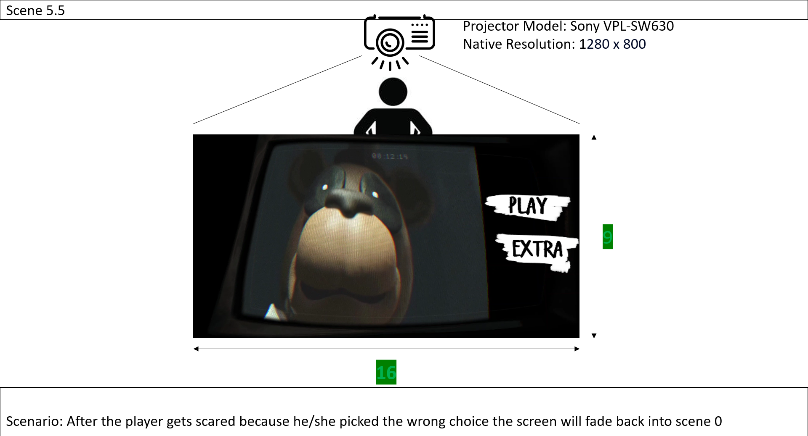
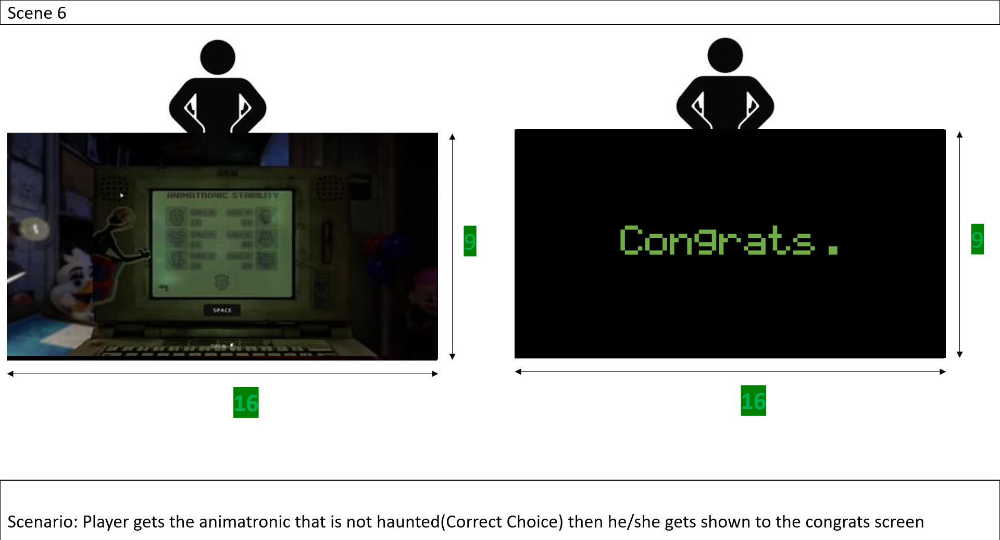

# System Diagram

## Video

## Audio

## Control

## Lighting

# CODE
    import RPi.GPIO as GPIO
    import time
    import socket
    import random

    TCP_IP = '192.168.254.11'
    TCP_PORT = 5612
    BUFFER_SIZE = 1024 
    MESSAGE = b"Sensor has detected"
    MESSAGE1 = b"Stop"
    MESSAGE2 = b"0"

    MESSAGE3 = b"Freddy right"
    MESSAGE4 = b"Freddy wrong"
    MESSAGE5 = b"Bonnie right"
    MESSAGE6 = b"Bonnie wrong"
    MESSAGE7 = b"Chica right"
    MESSAGE8 = b"Chica wrong"
    MESSAGE9 = b"Balloon Boy right"
    MESSAGE10 = b"Balloon Boy wrong"
    MESSAGE11 = b"Marionette right"
    MESSAGE12 = b"Marionette wrong"
    MESSAGE13 = b"Foxy right"
    MESSAGE14 = b"Foxy wrong"

    MESSAGE15 = b"1"
    MESSAGE16 = b"2"
    MESSAGE17 = b"3"
    MESSAGE18 = b"4"
    MESSAGE19 = b"5"
    MESSAGE20 = b"6"

    GPIO.setmode(GPIO.BCM)
    GPIO.setwarnings(False)
    GPIO_TRIGGER = 20
    GPIO_ECHO = 21
    GPIO_TRIGGER1 = 26
    GPIO_ECHO1 = 19
    GPIO_TRIGGER2 = 27
    GPIO_ECHO2 = 22

    GPIO.setup(GPIO_TRIGGER, GPIO.OUT)
    GPIO.setup(GPIO_ECHO, GPIO.IN)
    GPIO.setup(GPIO_TRIGGER1, GPIO.OUT)
    GPIO.setup(GPIO_ECHO1, GPIO.IN)
    GPIO.setup(GPIO_TRIGGER2, GPIO.OUT)
    GPIO.setup(GPIO_ECHO2, GPIO.IN)

    s=socket.socket(socket.AF_INET,socket.SOCK_STREAM)
    s.connect((TCP_IP,TCP_PORT))

    GPIO.setwarnings(False)
    GPIO.setmode(GPIO.BCM)
    GPIO.setup(23,GPIO.OUT)
    GPIO.setup(24,GPIO.IN)
    GPIO.setup(16,GPIO.IN)
    GPIO.setup(17,GPIO.IN)
    def distance():
        GPIO.output(GPIO_TRIGGER, True)
        time.sleep(0.00001)
        GPIO.output(GPIO_TRIGGER, False)
        StartTime = time.time()
        StopTime = time.time()
        while GPIO.input(GPIO_ECHO) == 0:
            StartTime = time.time()
        while GPIO.input(GPIO_ECHO) == 1:
            StopTime = time.time()
        TimeElapsed = StopTime - StartTime
        distance = (TimeElapsed * 34300) / 2
 
    return distance

    def distance1():

        GPIO.output(GPIO_TRIGGER1, True)
        time.sleep(0.00001)
        GPIO.output(GPIO_TRIGGER1, False)
        StartTime = time.time()
        StopTime = time.time()
        while GPIO.input(GPIO_ECHO1) == 0:
            StartTime = time.time()
        while GPIO.input(GPIO_ECHO1) == 1:
            StopTime = time.time()
        TimeElapsed = StopTime - StartTime
        distance1 = (TimeElapsed * 34300) / 2
    
        return distance1

    def distance2():

        GPIO.output(GPIO_TRIGGER2, True)
        time.sleep(0.00001)
        GPIO.output(GPIO_TRIGGER2, False)
        StartTime = time.time()
        StopTime = time.time()
        while GPIO.input(GPIO_ECHO2) == 0:
            StartTime = time.time()
        while GPIO.input(GPIO_ECHO2) == 1:
            StopTime = time.time()
        TimeElapsed = StopTime - StartTime
        distance2 = (TimeElapsed * 34300) / 2
    
        return distance2

    while True:
        light = random.randint(1,6)
        
            
        if GPIO.input(24):
            GPIO.output(23,True)
            s.send(MESSAGE)
            #data=s.recv(BUFFER_SIZE)
            time.sleep(1)
            s.send(MESSAGE2)
            #data=s.recv(BUFFER_SIZE)
            time.sleep(1)
        
            
        elif GPIO.input(16):
            GPIO.output(23,False)
            
            s.send(MESSAGE1)
            #data=s.recv(BUFFER_SIZE)
            time.sleep(1)
            s.send(MESSAGE2)
            time.sleep(1)
            
        elif GPIO.input(17):
            print(light)
            if light == 1:
                s.send(MESSAGE15)
                time.sleep(1)
                s.send(MESSAGE2)
            elif light == 2:
                s.send(MESSAGE16)
                time.sleep(1)
                s.send(MESSAGE2)
            elif light == 3:
                s.send(MESSAGE17)
                time.sleep(1)
                s.send(MESSAGE2)       
            elif light == 4:
                s.send(MESSAGE18)
                time.sleep(1)
                s.send(MESSAGE2)
            elif light == 5:
                s.send(MESSAGE19)
                time.sleep(1)
                s.send(MESSAGE2)         
            elif light == 6:
                s.send(MESSAGE20)
                time.sleep(1)
                s.send(MESSAGE2)         
         
    
               
          
        
    elif __name__ == '__main__':
        try:
                dist = distance()
                dist1 = distance1()
                dist2 = distance2()
                if dist  >= 1 and dist <= 10:
                    print ("Measured Distance = %.1f cm" % dist)
                    s.send(MESSAGE4)
                    time.sleep(1)
                    s.send(MESSAGE2)
                    time.sleep(1)
                elif dist >= 11 and dist <= 20:
                    s.send(MESSAGE3)
                    time.sleep(1)
                    s.send(MESSAGE2)
                    time.sleep
                elif dist >=21 and dist <=30:
                    s.send(MESSAGE9)
                    time.sleep(1)
                    s.send(MESSAGE2)
                elif dist >=31 and dist <=40:
                    s.send(MESSAGE10)
                    time.sleep(1)
                    s.send(MESSAGE2)
                    time.sleep(1)
                    
                    
                elif dist1  >= 5 and dist1 <= 10:
                    print ("Measured Distance = %.1f cm" % dist1)
                    s.send(MESSAGE5)
                    time.sleep(1)
                    s.send(MESSAGE2)
                    time.sleep(1)
                elif dist1  >= 11 and dist1 <= 20:
                    print ("Measured Distance = %.1f cm" % dist1)
                    s.send(MESSAGE6)
                    time.sleep(1)
                    s.send(MESSAGE2)
                    time.sleep(1)
                    
                elif dist2 >= 5 and dist2 <= 10:
                    print ("Measured Distance = %.1f cm" % dist1)
                    s.send(MESSAGE8)
                    time.sleep(1)
                    s.send(MESSAGE2)
                    time.sleep(1)
                elif dist2 >= 11 and dist2 <= 20:
                    print ("Measured Distance = %.1f cm" % dist1)
                    s.send(MESSAGE7)
                    time.sleep(1)
                    s.send(MESSAGE2)
                    time.sleep(1)
                    
                    
 
                    
        except KeyboardInterrupt:
            print("Measurement stopped by User")
                
             
       

        
    else:
        GPIO.output(23,False)
        
        

# Theme

### Theme: Horror

### Intention: Our goal is to let people experience a roulette style horror game that allows them to make decisions with interactive aspects like buttons 

### Age Group: 15+

## Choice of feature:
* Strengthen connections between brain cells when having to piece together the clues to pick the right choices
* Increased mental speed

## Intention of Use
#### Our project Freddy's is a game meant to be played one person at a time. This game is meant to stimulate the players brain by giving them a clue to choose the right button in order to survive.
#### Our game will feature 6 endings with 6 different cycles and clues, this makes the game harder to do as they cant just repeat the same cycle again and choose what they didnt the last time around.

# Research
Benefits of an Interactive Game

#### Games are engaging they require higher order thinking, problem solving and persistence. Many games, even first-person shooting video games (which may not be appropriate for children) teach cooperation, group work and scenario-based learning. Most games require strategy to understand and then work within the rules. 
#### All games offer a mix of intrinsic and extrinsic rewards. Humans play games precisely because they are captivating and reward us when we succeed. The Australian Office of the eSafety Commissioner, Think U Know UK, and the NZ organisation Netsafe all recognise that online games can help to develop teamwork, concentration, communication and problem-solving skills. 
#### They are also an opportunity for young people to practise communication and conflict resolution skills.

# References
https://www.youtube.com/watch?v=SkphKew4f60&ab_channel=IULITMx - Extras Footage

https://www.youtube.com/watch?v=Pvc4ymTTeqA&t=17s&ab_channel=IndieFuel - Gameplay Footage

https://www.youtube.com/watch?v=lN71sHGgdQ0&ab_channel=DarkTaurus - All Jumpscares

https://www.youtube.com/watch?v=ydcbIyJ8yVs&list=PL_2MB6_9kLAGMaFV1Vt4GE0v9dogNRf74&index=12&ab_channel=SoundLibrary - Buildup Sound

https://www.youtube.com/watch?v=e2wnNXIvMU4&ab_channel=AlihanEdits - Buildup scary noises

https://www.youtube.com/watch?v=T_0polYUnUs&list=PL_2MB6_9kLAGMaFV1Vt4GE0v9dogNRf74&index=2&ab_channel=SoundLibrary - Win/Lose Background music

https://www.youtube.com/watch?v=xAO3x-Uhfoo&ab_channel=ESNProductions - Ambiance Sound

https://www.youtube.com/watch?v=LhKlCp5Sh9I - Music Box Background Music

# Storyboard

