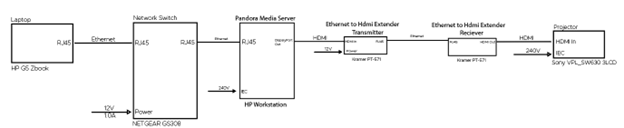
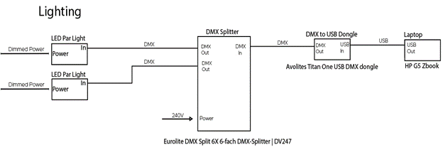
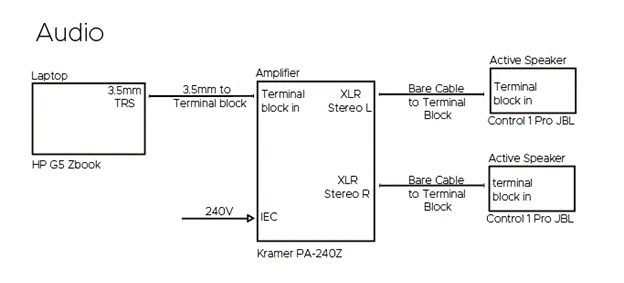

# EGL 314 PROJECT FREDDY'S - GROUP C

# Theme

### Theme: Horror

### Intention: Our goal is to let people have an short but horrifying experience that will stay with them for a long time, we will achieve this by utilizing the combination of great lighting, surround sound and good buildup and visuals

### Age Group: 15+

## Choice of feature:
- Memorable Experience: The combination of lights, surround sound, and good video can create a memorable experience that stays with the viewers long after the project is over.

## Intention of Use
- Our project Freddy's is a game meant to be played one person at a time. This game is meant to stimulate the players brain by giving them a clue to choose the right button in order to survive.
- Our game will feature 6 endings with 6 different cycles and clues, this makes the game harder to do as they cant just repeat the same cycle again and choose what they didnt the last time around.

# Research
Benefits of an Interactive Game:

- Games are engaging they require higher order thinking, problem solving and persistence. Many games, even first-person shooting video games (which may not be appropriate for children) teach cooperation, group work and scenario-based learning. Most games require strategy to understand and then work within the rules. 
- All games offer a mix of intrinsic and extrinsic rewards. Humans play games precisely because they are captivating and reward us when we succeed. The Australian Office of the eSafety Commissioner, Think U Know UK, and the NZ organisation Netsafe all recognise that online games can help to develop teamwork, concentration, communication and problem-solving skills. 
#### They are also an opportunity for young people to practise communication and conflict resolution skills.

# System Diagram

## Video

## Audio

## Control

## Lighting

# Storyboard

# System Diagram

# Control

# Video

# Lighting

# Audio

# References
https://www.youtube.com/watch?v=SkphKew4f60&ab_channel=IULITMx - Extras Footage

https://www.youtube.com/watch?v=Pvc4ymTTeqA&t=17s&ab_channel=IndieFuel - Gameplay Footage

https://www.youtube.com/watch?v=lN71sHGgdQ0&ab_channel=DarkTaurus - All Jumpscares

https://www.youtube.com/watch?v=ydcbIyJ8yVs&list=PL_2MB6_9kLAGMaFV1Vt4GE0v9dogNRf74&index=12&ab_channel=SoundLibrary - Buildup Sound

https://www.youtube.com/watch?v=e2wnNXIvMU4&ab_channel=AlihanEdits - Buildup scary noises

https://www.youtube.com/watch?v=T_0polYUnUs&list=PL_2MB6_9kLAGMaFV1Vt4GE0v9dogNRf74&index=2&ab_channel=SoundLibrary - Win/Lose Background music

https://www.youtube.com/watch?v=xAO3x-Uhfoo&ab_channel=ESNProductions - Ambiance Sound

https://www.youtube.com/watch?v=LhKlCp5Sh9I - Music Box Background Music
